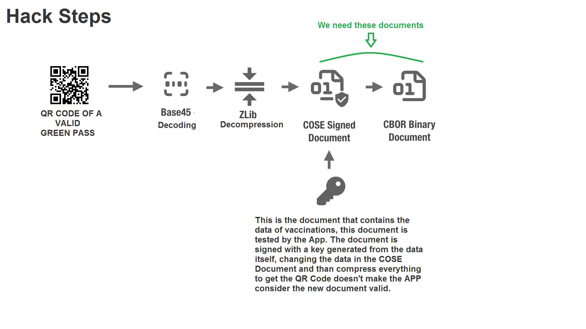
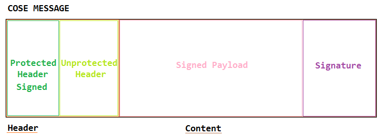
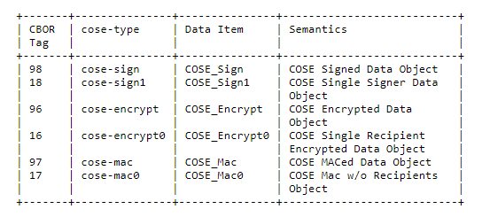

# GreenPass-Experiments
This project was started with the intention of violating the Italian GreenPass which should serve in theory to prevent the spread of COVID-19 but which in my opinion is not very effective.
This is because vaccinated people can contract the virus and can be contagious. In addition, the GreenPass limits personal freedom even more with senseless measures that even prevent you from working, for example in schools where all the students, who are used to moving in crowded public transport do not have to show any GreenPass while the teachers who are mostly at a distance behind the desk and they use their private cars must have the GreenPass to work. Moreover, to access many closed places it is necessary to have the GreenPass but it has been decided that the holders cannot force customers to show an identity document along with the GreenPass and this allows anyone to enter that place using the GreenPass of another. To conclude the owner of a business does not have the time to also check the GreenPass or the money to pay someone to do it.
Therefore it would be appropriate to remove it and use the tools already used and tested to fight the pandemic.

## WARNING

<p><b>IMPORTANT NOTE: </b>I just want to inform you that show a Green Pass self-generated, at least in Italy, is illegal. This project has been made as a hobby and as a personal challenge.</p>
 
 <p><b>I DO NOT PROMOTE IN ANY WAY ILLEGAL ACTIVITIES</b></p>
 
 To simplify the reading of the project, I have chosen to modify the entire Readme file. You can find the old version here: [README.md](https://github.com/jojo2234/GreenPass-Experiments/blob/main/README_BKP.md)

## Prepare your environment

<b>The entire project is available [HERE](https://github.com/jojo2234/GreenPass-Experiments/blob/main/VerificaC19_SRC.7z) with install [instructions](https://github.com/jojo2234/GreenPass-Experiments/blob/main/INSTALL_INSTRUCTIONS.md). </b>

If you want you can download the documentation and the programs to read and create QR Code.

* To prepare your environment, follow the [instructions](https://github.com/jojo2234/GreenPass-Experiments/blob/main/INSTALL_INSTRUCTIONS.md).
* Get the Green Pass documentation and other useful stuff to learn:
   * Documentation: https://github.com/ministero-salute/it-dgc-documentation
   * Italian Android App: https://github.com/ministero-salute/it-dgc-verificaC19-android
   * Core Android App: https://github.com/eu-digital-green-certificates/dgca-app-core-android
* Get a valid green pass, I think it's better one of someone who gives you the permission.
* Get a QR Code Generator, on Windows I use ZInt from https://zint.github.io/
* Get a QR Code Reader, I use an Android App, for Windows you could use this https://www.codetwo.com/freeware/qr-code-desktop-reader/

## The structure of a Green Certificate

The Green Pass is a QRCODE and a QRCode is data shown in another form. We can use software that read QR Code like [CodeTwo](https://www.codetwo.com/freeware/qr-code-desktop-reader/) to get the data inside it. For the Green Pass the data are an ASCII string like this:

`HC1:NCFOXNEG2NBJ5*H:QO-.OMBN+XQ99N*6RFS5*TCVWBM*4ODMS0NSRHAL9.4I92P*AVAN9I6T5XH4PIQJAZGA2:UG%U:PI/E2$4JY/KB1TFTJ:0EPLNJ58G/1W-26ALD-I2\$VFVVE.80Z0 /KY.SKZC*0K5AFP7T/MV*MNY\$N.R6 7P45AHJSP\$I/XK\$M8TH1PZB*L8/G9HEDCHJ4OIMEDTJCJKDLEDL9CVTAUPIAK29VCN 1UTKFYJZJAPEDI.C\$JC7KDF9CFVAPUB1VCSWC%PDMOLHTC\$JC3EC66CTS89B9F$8H.OOLI7R3Y+95AF3J6FB5R8QMA70Z37244FKG6T\$FJ7CQRB0R%5 47:W0UFJU.UOJ98J93DI+C0UEE-JEJ36VLIWQHH\$QIZB%+N+Y2AW2OP6OH6XO9IE5IVU\$P26J6 L6/E2US2CZU:80I7JM7JHOJKYJPGK:H3J1D1I3-*TW CXBD+$3PY2C725SS+TDM\$SF*SHVT:5D79U+GC5QS+3TAQS:FLU+34IU*9VY-Q9P9SEW-AB+2Q2I56L916CO8T C609O1%NXDU-:R4TICQA.0F2HFLXLLWI8ZU53BMQ2N U:VQQ7RWY91SV2A7N3WQ9J9OAZ00RKLB2`

In this string the escape characters like backslash are not necessary and can be manually removed. The HC1: is the prefix of this string and get removed by the App that validates the Green Pass. This string is coded in Base45, when get decoded a Zlib archive is the result. Inside the Zlib archive there is a file in CBOR format COSE structured, this is the file that the app check to validate the signature. This file can be decoded to obtain some other data like an header that allow to get the KID necessary to speed up  the process of reasearch of the key in the database of the app, a cbor string/file that if decoded lead to a JSON file with the data of the Green Pass like the name of the person who own the Green Pass or the date of vaccination, and the signature that sign the previous data.

Because the App validates the COSE document ([RFC8152](rfc8152.html)) generated from a CBOR document ([RFC8949](rfc8949.html)), the first step is decode the qr code to achive these data. In the image below, it's possible to see the steps to get the documents.

<p align="center">

<p align="center"><i>The steps to decode a QR Code</i></p>
</p>

After got the `cbor` from the structured COSE data it's possible to alter the data in it. And then it's possible to encode the new data, sign them and get a valid qr code. Actually the signing part has not been still tested, but to make this file more readble I had to explain every steps from the beginnig. As I have already said above it is the COSE file that get signed. Specifically the protected header in the header section and the CBOR payload that if get opened by the Kotlin class called CoseData.kt, it gives a result composed of two element (kid+cbor), where cbor in this case is the encoded JSON that contains the data about the Green Pass.

### Structure of a COSE file

<p align="center">

<p align="center"><i>Structure of a COSE file</i></p>
</p>

In the photo above it's possible to see an approximation of the structure of a COSE file. Below there is an image that explains the CBOR values.

<p align="center">

<p align="center"><i>Tag CBOR</i></p>
</p>

My greenpass has 18 as CBOR tag, so it is Sign1. I think every Italian GreenPass has the same encryption.

## Differences and Corrections
In the previous readme and in the previous codes I have committed some errors due to the fact I was learning while I was making tests. So here there's a list with my new notions:
* Each entity in a state who is able to emit a Green Certificate has is personal key, who allow to verify all the Green Passes of that nation. In Italy the owner of the key is the Ministry of Health.
* The App [VerificaC19](https://play.google.com/store/apps/details?id=it.ministerodellasalute.verificaC19&hl=it&gl=US) used to validate the Green Pass download a database that contains these keys. For unknown reasons the keys are encrypted. However I can decrypt them.
* The room master table in the database contains a checksum to check the integrity of the database is not a relevant key
* To get the encrypted [database](DB_PublicKeys_VerificaC19) you can download my version or use the system I used to get it, which is sniff the TLSv1.3 traffic between the app and the sever. You can do the same following the old [README](https://github.com/jojo2234/GreenPass-Experiments/blob/main/README_BKP.md) file and helping yourself with the documentation in ([RFC8446](rfc8446.html)), ([RFC8447](rfc8447.html)), ([RFC8449](rfc8449.html)) that explain how TLS works. However, if I'm not wrong the database shouldn't change. For this reason from this readme file I have removed the section that explain how to get this DB. To open the DB you can use [DB_Browser_for_SQLITE](https://sqlitebrowser.org/).
* My previous conclusive idea was wrong. Because it's not possible with the decrypted public key sign a fake Green Certificate and make it authentic. You can find the decrypted Italian key used to verify the signature in [GettingUp.kt](GettingUp.kt).
* I have never had experience with the Kotlin language, but because is the official language of the App I have tried to use it, taking advantage from my previous Java experiences.
* I need to thanks zorginho1, luke-z and Davr10100 to help me understand fastly that in the DB there isn't a key for each Green Pass in Italy. Thank you, I will have spent about other 3 days to uderstand that. The truth is that a Green Certificate emitter creates a private and a public key. The private key sign the certificate and get verified by the public key.
* Thank you to everyone who bought me a coffee and to everyone who will buy me a coffee in the future:

<a href="https://www.buymeacoffee.com/loberry"></a>


## Kotlin main code

Using the instructions here: https://github.com/jojo2234/GreenPass-Experiments/blob/main/INSTALL_INSTRUCTIONS.md you can implement the file GettingUp.kt that I have made with a great effort. I have merged functions from different classes to simplify the reading and I have created new functions to encode the decoded data you will get. I have removed the steps to make everything working because now you can get instructions and the entire project.

1. [Instructions to make everything working](https://github.com/jojo2234/GreenPass-Experiments/blob/main/INSTALL_INSTRUCTIONS.md)
2. [The complete project](https://github.com/jojo2234/GreenPass-Experiments/blob/main/VerificaC19_SRC.7z)
3. I have updated the entire project, due to the necessity to add some java classes. Next changes should interest only the GettingUp.kt file.

I will keep the [GettingUp](GettingUp.kt) file updated. With the GettingUp.kt you can get a valid modified structured Green Certificate but still not signed.

Now I have understood that the only valid method to make a fake and valid Green Pass is getting the private key which allow to sign a real Green Pass. My previous methods that I have studied cannot works on this asymmetric encryption. You can read about encryption systems in the old [README](README.bkp.md). Because it's not possible add data to make a old signature correspond to the new data due to the limited number of characters that are possible insert in a QR Code and due to app limitation because the developer have further decreased the maximum size of the CBOR.

## The signature
The app uses an asymmetric method to verify the signature. With a Public and a Private Key. The private key sign the payload and the protected header and the public verify that the data have signed with that private key. The object to get a valid signature to be inserted in our fake Green Pass is the same used to verify it (I'm not sure). That's because the method used to updates the data to be verified; updates the data to be signed too. The object is structured in this way: 

`["Signature1" as String,ProtectedHeader as ByteArray,Empty ByteArray, CBOR+KID as ByteArray]`.

For this reason I can consider that the only thing we need is a Private Key. The things we have got are:

1. A valid signature from a real Green Pass
2. Data of the signed content
3. The algorithm that verify a signature
4. The public keys decrypted used by the App to verify a signature

If it's possible from this information retrieve the private key, we get a valid and fake certificate.

### Algorithms used to verify the signature
There are two algorithm used to verify the signature:
* ECDSA_256 (NIST P256, Curve type: secp256r1, Random Method: x9.92, prime256v1) Used in Italy.
* RSA_PSS_256

### ECDSA 256
The algorithm uses an elliptic curve to generate a finite cloud points that follow the curve where a starting point called G is randomly or manually choosen. This point is composed of two coordinates *x* and *y* on a plan. Then a sequence of numbers is created randomly, this sequence, which lenght is unknown, is the Private Key. After that the Public Key is obtained multiplying G for the Private Key. To sign a message the message is hashed using SHA256 the result of the hash is converted into an Integer that we call *SHM* . Then a new randomic value get generated. This value is called *k*. Now the message can be signed, the signature is a tuple composed of two parameters *r* and *s* Where *r* is *k* multiplied *G* and *s* is *SHM* that sum *r* multiplied the Private Key everything divided by *k*. 
If we know *k* to get the Private Key we can do: ((*k*\**s*)-*SHM*)/*r*

However, how to get *k*? I've found that the crypto library BouncyCastle has a vulnerability reported on May 2021, on GitHub. If who made the keys has used this library maybe it's possible to get the Private Key, they say:

"*Bouncy Castle BC Java before 1.66, BC C# .NET before 1.8.7, BC-FJA 1.0.0, 1.0.1, and 1.0.2, and BC-FNA 1.0.1 have a timing issue within the EC math library that can expose information about the private key when an attacker is able to observe timing information for the generation of multiple deterministic ECDSA signatures.*"

Reading this, more Green Pass a researcher own more it's possible getting the Private Key; which is only one in Italy, the value that changes is *k*. But, in my opinion they have used SunEC as provider for the cryptography.

Anyway in my experiments I am able to get the signature only in a unique sequence of bytes and not in two different parameters *r* and *s*. In my signatures, it's possible to see that the first byte is the same in different signature. That's is most probable due to the structure of the signature. Actually after some research I've found the structure of the signature should be in DER format.

These reasearches lead me to consider that it's possible get *r* and *s* from a signature and easily it's also possible to get *SHM* but I still don't know how to get *k*. If someone know how to do it, please write it in the discussion page. However, the private key that must be inserted in GettingUp.kt is longer than the public key. Here is an example of the Italian Private Key where you should replace the sequence of `0,0,0...` with the 256 bits of the real private key which are 32 bytes. When the replacement is done you can insert this key in the byte array I have designed to do that.

`var privByteA: ByteArray = byteArrayOf(48,-127,-109,2,1,0,48,19,6,7,42,-122,72,-50,61,2,1,6,8,42,-122,72,-50,61,3,1,7,4,121,48,119,2,1,1,4,32,0,0,0,0,0,0,0,0,0,0,0,0,0,0,0,0,0,0,0,0,0,0,0,0,0,0,0,0,0,0,0,0,-96,10,6,8,42,-122,72,-50,61,3,1,7,-95,68,3,66,0,4,-100,-65,126,90,114,41,-11,-5,-37,114,-121,25,72,101,5,-107,44,61,125,-11,-65,-115,-77,14,55,55,47,-101,85,-8,115,-22,87,56,-15,44,-20,46,63,-13,127,-113,-59,47,18,-63,-26,-74,-122,9,-65,-76,-85,120,60,-115,51,-13,8,39,33,-24,104,-113)`

Anyway, what I've discover about the Italian signature is that starts with byte `88` and the next byte is `64` which is the lenght of the signature. Instead, when I generate a signature with my code it starts with `48` and the follow byte is `69`. My other experiments lead me to consider `r` as the first 32 bytes after the byte `64` and `s` the follow 32 bytes after `r`. Now, I know for sure that the signature is a DER fromat defining an ASN.1. The first byte is 0x80 plus 8 bits which are the next byte (0x64). I've just made a similar system in GettingUp.kt that create a 64 byte signature. To make it works you need to download the entire [project](https://github.com/jojo2234/GreenPass-Experiments/blob/main/VerificaC19_SRC.7z) with the new Java classes in it. 

Consider that the above byte array is structured on the BouncyCastle provider while now in GettingUp.kt is used SunEC. The structure of a Private Key in SunEC is different, you can look at the differences in this [IMAGE](https://github.com/jojo2234/GreenPass-Experiments/blob/main/SunEC_Provider.png). The new byte array should have this form: 

`var privByteA: ByteArray = byteArrayOf(48,65,2,1,0,48,19,6,7,42,-122,72,-50,61,2,1,6,8,42,-122,72,-50,61,3,1,7,4,39,48,37,2,1,1,4,32,52,-102,66,-80,-62,-48,114,-114,105,37,-73,38,13,24,19,-19,-78,113,-59,68,10,-96,-11,60,127,-35,-94,-2,-88,-105,105,-69) //An example of private key that respect SunEC provider structure`


## Conclusion
Thank you to everyone who have contributed to the project and to everyone who support me. It has been a great effort to get here. We have a Kotlin file who is able to decode modify and encode a Green Pass and now even sign it. But you need to find a valid Private Key. When you transform the string with prefix `HC1` in QRCode remember to remove invisible characters at the end of the string like space or line return.

With the new update of GettingUp.kt you can verify that the script correctly sign a green pass if you have a valid private key. To validate your modified Green Certificate you can try with these keys:

Private Key in PEM form PKCS8 encoded:
```
MIGHAgEAMBMGByqGSM49AgEGCCqGSM49AwEHBG0wawIBAQQgLeL3/sm5YEHYfYxvLv93FIYL5ILodXcXPgV3RyaEPp6hRANCAAT31hTLVdVmxvlaLLB4Hyh7pQbD4zkwfaf8Be5yP+ChH7ZnxcGq6lJ6hXuA2YmsqgDxtQ3e03kNfxgJ8kojhEQ/
```
Public Key inside a X.509 certificate in PEM form:
```
MIIB6zCCAZGgAwIBAgIUNuto0G4FPXkZnTKqtCZLD401g3MwCgYIKoZIzj0EAwIwSzELMAkGA1UEBhMCSVQxDjAMBgNVBAgMBUl0YWx5MR8wHQYDVQQKDBZNaW5pc3Rlcm8gZGVsbGEgU2FsdXRlMQswCQYDVQQLDAJNUzAeFw0yMTEwMDcxOTEwMzFaFw0yMjEwMDIxOTEwMzFaMEsxCzAJBgNVBAYTAklUMQ4wDAYDVQQIDAVJdGFseTEfMB0GA1UECgwWTWluaXN0ZXJvIGRlbGxhIFNhbHV0ZTELMAkGA1UECwwCTVMwWTATBgcqhkjOPQIBBggqhkjOPQMBBwNCAAT31hTLVdVmxvlaLLB4Hyh7pQbD4zkwfaf8Be5yP+ChH7ZnxcGq6lJ6hXuA2YmsqgDxtQ3e03kNfxgJ8kojhEQ/o1MwUTAdBgNVHQ4EFgQUyib2jwQJTU9cdZCBZgnvELb1s74wHwYDVR0jBBgwFoAUyib2jwQJTU9cdZCBZgnvELb1s74wDwYDVR0TAQH/BAUwAwEB/zAKBggqhkjOPQQDAgNIADBFAiBAldqWWmZHxeNKoOfMX8qTqZKez9KiuGIk5dASp/D16QIhAMOvMqtpSr+GbDTZrc6w4ShreBDDyxl1nh+R97ShbVEF
```

## License
BSD 3-Clause "New" or "Revised" [License](https://github.com/jojo2234/GreenPass-Experiments/blob/main/LICENSE)
