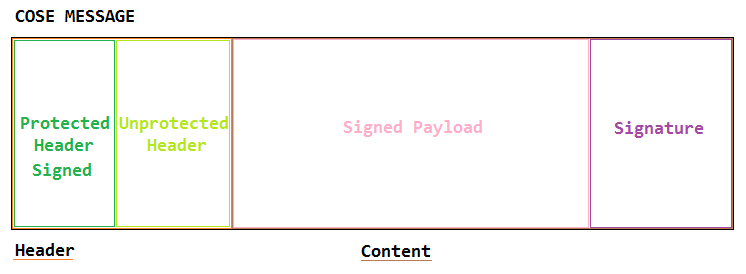

# GreenPass-Experiments
This project was started with the intention of violating the Italian GreenPass which should serve in theory to prevent the spread of COVID-19 but which in my opinion is not very effective.
This is because vaccinated people can contract the virus and can be contagious. In addition, the GreenPass limits personal freedom even more with senseless measures that even prevent you from working, for example in schools where all the students, who are used to moving in crowded public transport do not have to show any GreenPass while the teachers who are mostly at a distance behind the desk and they use their private cars must have the GreenPass to work. Moreover, to access many closed places it is necessary to have the GreenPass but it has been decided that the holders cannot force customers to show an identity document along with the GreenPass and this allows anyone to enter that place using the GreenPass of another. To conclude the owner of a business does not have the time to also check the GreenPass or the money to pay someone to do it.
Therefore it would be appropriate to remove it and use the tools already used and tested to fight the pandemic.

## WARNING

<p><b>IMPORTANT NOTE: </b>I just want to inform you that shows a Green Pass self-generated, at least in Italy, is illegal. This project has been made as a hobby and as a personal challenge.</p>
 
 <p><b>I DO NOT PROMOTE IN ANY WAY ILLEGAL ACTIVITIES</b></p>

## What do you need?
* An IDE to make some experiments, you can download and install IntelJ Idea + Kotlin language support from https://www.jetbrains.com/idea/download/#section=windows
* A python interpreter to execute the code, you can download and install Python from https://www.python.org/downloads/
* A good text editor like VS Code https://code.visualstudio.com/
* The GreenPass documentation and other stuff:
  * Documentation: https://github.com/ministero-salute/it-dgc-documentation
  * Italian Android App: https://github.com/ministero-salute/it-dgc-verificaC19-android
  * Core Android App: https://github.com/eu-digital-green-certificates/dgca-app-core-android
* A valid green pass, I think it's better one of someone who gives you the permission.
* A QR Code Generator, on Windows I use ZInt from https://zint.github.io/
* And a QR Code Reader I use an Android App, for Windows you could use this https://www.codetwo.com/freeware/qr-code-desktop-reader/

## Python scripts to get some documents
Because the App validates a document called COSE document ([RFC8152](rfc8152.html)) generated from a CBOR document ([RFC8949](rfc8949.html)), I've found online a python script that I have modified and will help us to get these documents. In the image below, it's possible to see the steps to get the documents.

<p align="center">

<p align="center"><i>What does the script.</i></p>
</p>

### Steps to decode
1. Decode the QR Code using an App like QRCode Reader
2. Save the decoded content that is an alphanumeric string in a text document (UTF-8) use VS Code
3. Copy this content in the script where is reported your payload here
4. Remove the HC1: prefix from the payload
5. Run the script and you will get the signed COSE file and the JSON of your greenpass

```
import json
import sys
import zlib
import base45
import cbor2
from cose.messages import CoseMessage
#Remove Prefix HC1: from the obtained result
payload = "YOUR payload HERE"
decoded = base45.b45decode(payload)
decompressed = zlib.decompress(decoded)
cosefile=open("greenpassfile.cose", "wb")
cose = CoseMessage.decode(decompressed)
cosefile.write(decompressed)
cosefile.close()
print(json.dumps(cbor2.loads(cose.payload), indent=2))
```
NOTE: All the work will be done on the COSE file.

### Steps to code
Now to be sure that everything worked fine, code the COSE file again in QR Code with the script below.
```
import json
import sys
import zlib
import base45
import cbor2
from cose.messages import CoseMessage
print("Coding in QRCODE: \r")
recoded=open("greenpassfile.cose", "rb")
coseloya=recoded.read()
cosepress = zlib.compress(coseloya)
recoded.close()
convBase = base45.b45encode(cosepress)
print("HC1:")
print(convBase)
```
1. Using VS Code or notepad concatenate the HC1: prefix with the result of `convBase`, while doing this be sure to don't take the \b and the quotes.
2. Now copy all on the QR Code Generator, generate the QR Code and test it with the C19 App: https://play.google.com/store/apps/details?id=it.ministerodellasalute.verificaC19&hl=it&gl=US
3. If you get the same QR Code you are ready to proceed to hack the COSE file.

## Structure of a COSE file

<p align="center">

<p align="center"><i>Structure of a COSE file</i></p>
</p>

In the photo above it's possible to see an approximation of the structure of a COSE file. Below there is an image that explains the CBOR values.

<p align="center">

<p align="center"><i>Tag CBOR</i></p>
</p>

My greenpass has 18 as CBOR tag, so it is Sign1. I think every Italian GreenPass has the same encryption.

## Get the public keys
After obtaining the COSE file with the private key of the certificate, we need to get all the public keys to find the one who is able to decrypt the real green pass.
These public keys also called certificates and are not public, which means there's no official way to get them or a website where to download them, so we need to find a way to get them.
I believe there are 2 valid solutions to get these certificates:
1. Take an Android phone and look inside the files used by the APP
2. Use a network sniffing tool to intercept the file when it is downloaded by the App
3. Download the file from a browser or build a program to download the file

The third option for me is not possible, so I've chosen the second option, but I've stuck in a problem the conversation is cryptographed with TLSv1.3, anyway I have intercepted everything from the beginning and I think it's possible to decrypt the data but I am forced to spend time on this before going on with the greenpass hacking. For curious, that's is one of the reasons why the third point is a waste of time:
```
class HeaderInterceptor : Interceptor {

    private val userAgent = "DGCA verifier Android ${Build.VERSION.SDK_INT}, ${Build.MODEL};"
    private val cacheControl = "no-cache"
```
As you can see the request is customized in a way that only the App can retrieve the public keys.

The way to get the public keys is the following:
1. Take a computer with two network cards and use it as a sniffer
2. Make this computer a hotspot of your internet wifi and start your prefered sniffer software you could use [wireshark](https://www.wireshark.org/) as well
3. Connect the phone with the App for the first time in the day to your computer
4. Make sure is the first time you connect the phone to the Internet or you will get forced to uninstall the App VerificaC19 and reinstall it again
5. Open the App and after checked that has updated the keys you can close it and disconnect the phone then stop the sniffer.
6. Now you have the packets encrypted with TLSv1.3; in ([RFC8446](rfc8446.html)), ([RFC8447](rfc8447.html)), ([RFC8449](rfc8449.html)) is explained how it works, the only thing to do is decrypt the packets and merge them to get the file.
7. I will not explain here how to sniff packets and how to decrypt them because it's not related to the scope of this project. However, I will load my capture [here](DB_PublicKeys_VerificaC19). The DB is updated to 1 September 2021.
8. You should get only one file in SQLLite format, that you can open with your favourite DB manager. I'm using [DB_Browser_for_SQLITE](https://sqlitebrowser.org/)
9. Now we are gonna create a script that will be able to verify real green pass using the database of public keys.
10. And as the final step after tested our script I'll try to make some other cool stuff.

### NOTE
Perhaps I'm wrong. I don't know how to explain it, but as you can see in RFC8152, the KID is an index used to improve the speed of research of public keys, in the public keys DB there are 165 (one hundred sixty-five) KID and each KID has a relation with about 40 (forthy) public keys, whereas we know a public key identifies only one Green Pass for each person in Italy. So assuming I could have made a wrong count. I want to say that there are about 50 public keys for KID and that means that there are about 8000 (eight thousand) public keys. So 8000 green pass. How is that possible? 
Update: Good news, seems I was wrong. Thanks to zorginho1, luke-z and Davr10100. I've understood that there's only one public key for each KID, the public key is created from all the greenpasses created by a country. So the public key is not related to one greenpass only but to every registered greenpass. And as reported by zorginho1 seems that each kid identify the validator of where the greenpass has been relased. However I still need to be sure of that, you know, to better understand. 

## Green Pass verifier script

To verify real greenpass I'm developing a script, after that I will proceed with the creation of a fake one with an accurate technique I will explain later.

Because the last hacking section is extremly difficult you can support me with buy me a coffee. Thank you.

<a href="https://www.buymeacoffee.com/loberry"></a>

### Python script to browse the SQLDB
```
import sqlite3
import json
import sys
import zlib
import base45
import cbor2
from cose.messages import CoseMessage

conn=sqlite3.connect('pubkeys.db') #Change relative path with an assolute one, ex. C:\\Users\\User\\Desktop\\HackGreenPass\\pubkeys.db
cursor=conn.cursor()
cursor.execute(''' SELECT kid FROM keys; ''')
rows = cursor.fetchall()

for row in rows:
 print(row[0])
 
cursor.close()
conn.close()
```
Summarizing: You can get the pubkeys.db [here](DB_PublicKeys_VerificaC19), download it and rename it as pubkeys.db, in this database there are the public keys, the private key is in your greenpass.

#### Personal experiment
These days I'm trying to understand how to verify the COSE file using the Kotlin language.
Until now I've understood that the QR Code string doesn't need the escape character '\\' to be decoded by the Kotlin class Base45Decoder. And most important in Kotlin seems not possible to decode a ByteArray and get the same ByteArray encoded with the classic Java methods. For example, you can try to use `.decodeToString()` on a ByteArray and then `.encodeToByteArray()` and you will get another kind of ByteArray not the same if you decode it again in string maybe you will get the same string, but the ByteArray is different. I suspect is related to some aspect of character encoding.

Decoding the COSE file with a COSE class it's possible to obtain a CBOR string and his KID, the CBOR string cannot be changed easily without destroying the CBOR structure, to add data to a CBOR string it's important to follow the CBOR protocol defined in the RFC8949. The function that verifies the hash code of the CBOR in Kotlin is the following:
```
fun hashCode(): Int{
 var res = cbor.contentHashCode();
 res = 31 * res + (kid?.contentHashCode() ?: 0);
 return res;
}
```
Where cbor is a ByteArray that contains the essential greenpass data in the CBOR format and the called function on it is a Java function that returns the hashCode of the ByteArray in Java is called with `java.util.Arrays.hashCode(byteArrayOBJ);`. After the generation of an hashCode of the cbor, that hashCode is multiplied for 31 and is added to the hashCode of the kid, if the kid is null will return 0. All this stuff is saved and returned through res. The initial steps of my tests require that the obtained hash code kid will be compared with kids in the database. I'm writing here these things to keep a log of my progress.

### Kotlin code to verify the greenpass

Using the code published here: https://github.com/eu-digital-green-certificates/dgca-app-core-android you can implement the class GettingUp.kt that I have made with a great effort. I have merged functions from different classes to simplify the reading and I have created new functions to encode the decoded data you will get. Here are the steps to make everything working:

1. Download the zip project from [here](https://github.com/jojo2234/GreenPassHack/blob/main/dgca-app-core-android-main.zip), if you download it from the original repository be aware of the version because MykhailoNester has updated it, I don't know if it's related to the email I've sent to him. However, to avoid problems with versions, I have uploaded the old ones that I own.
2. Download Java [version 8](https://www.oracle.com/java/technologies/javase/javase-jdk8-downloads.html#license-lightbox) that require a registration and the [last version](https://www.oracle.com/java/technologies/javase-jdk16-downloads.html).
3. Install Java both versions, first install the new version
4. Download Android Studio: https://developer.android.com/studio/ and install it
5. In Android Studio download the SDK, API Level 26 and 29. You can help yourself with this article: https://developer.android.com/studio/intro/update#sdk-manager
6. Now you can extract the zip file of the project on a folder
7. Open the project with Android Studio and wait until it finishes to download all the things.
8. On the left panel click with the mouse right button on <i>dgca.verifier.app.decoder</i> and create a new Kotlin File, not a class, call it GettingUp
9. Copy the content of the file [GettingUp.kt](GettingUp.kt) in the file you have just created.
10. You should be able to run the file to get a decoding and encoding test.

I will update the GettingUp.kt file soon, in order to correct some bugs that prevent getting a working encoding from COSE structured data to base45+QRCode. And in the meanwhile I will try to implement a way to read the database, these are my first experiments with the Kotlin language.

On 10 September 2021 after about 12 days since I've started the project, it's now possible to use the GettingUp.kt Kotlin file to access all data of a Green Certficate and to replace them with yours. Most important with the same script it's possibile to get a validation of the Green Certificate or Green Pass. What must be done is the access to the public key db in the Kotlin script to automatize the signature verification.

On 13 September 2021 I still don't have understand what's inside the DB on the key called *key*. The KID in the DB is the same kind of KID you can obtain from a greenpass decoding to a string the KID. For each KID in the DB should exist a group of keys that is referred to that KID so the research of key is speeded up, but in key near each KID there's a blob of data of different dimensions and I can't believe that there are keys in it for 30 milion of person. The truth is that each KID is rappresentative of only one public key for country that is updated each time a new greenpass get registered. Anyway these public keys are encrypted. And using kotlin I still don't have decrypted them. 
I forgot to inform you that I have changed in CoseData.kt each val in var to allow modification of data. And to decrypt the keys in the DB you need to copy the security folder in your project from the [Italian project](https://github.com/ministero-salute/it-dgc-verificaC19-android).

On 15 September 2021 I have implemented encodeCertificate it's not more necessary to modify the cbor using the mutuable list. Still not working well due to JSON parsing. To get a working result you need to change `val` to `var` in these classes: GreenCertificate.kt and Person.kt. However I've chosen to modify the cbor object that host the compressed version of the JSON certificate. It's easier and there's no need to alter these classes.

## Encryption systems (simplified explanation)
I'm going to explain this argument out of context to give an idea on what kind of signature there is on the green pass. 

We can consider three types of encryption in telecommunications.

1. Symmetric Encryption 
2. Asymmetric Encryption
3. Quantistic Encryption

The symmetric encryption is the most used and the most common. The message is encrypted with a key and send through a channel (that could be Internet) than is decrypted with the same key. The complexity of the key and/or of the algorithm used to encrypt the message can change. However, the key is one only, for this reason, who gets the key and the used algorithm, gets the message. This technology is used by HTTPS (The "secure" version of HTTP), WhatsApp, Telegram and so many other app and services. A Man in The Middle Attack performed against this encryption from the beginning of the communication is enough to get all the messages. That's because the channel used to transfer the key is usually the same one used to transfer the message. A Man In The Middle Attack is the most common attack, and it's easy to implement it, for example, your home modem/router can get hacked or you can accidentally connect your device to a compromised wifi network, or in the worst case your ISP could have a router infected or your cable/phone line could be physically compromised.

The asymmetric encryption use two different keys, one is used to encrypt the message and the other to decrypt it. The sender owns two keys, one is public and each participant in the communication can get it or request it from the sender, the other is private only the sender knows it. The receiver has got is two keys too, one is public and the sender can obtain it and the other is private only the receiver can access it. So, the sender uses the public key of the receiver to encrypt the message and the receiver with its private key is able to open it. And most important the identity of the sender can be certified if the sender: first encrypt the message with its private key and then encrypt this encrypted message with the public key of the receiver, in this way the receiver is the only one able to open it and can confirm the identity of the sender because is able to decrypt the message with the public key of the sender. Anyway, even this encryption system can get hacked by the Man In The Middle Attack who can simulate to be both, the sender and the receiver, using his personal keys to make the other thinking he/she is speaking with the right person.

The quantistic encryption is not for anyone, maybe it's used on some optical fibre backbone or it's not used yet. To explain this encryption system as easiest as I can, I will try to explain the BB84 protocol. We have a bit that can be 0 or 1, and four states defined with angles. Changing the angle of a photon is called polarization. We say that bit 0 is a photon in a vertical state or in +45 degree state and 1 is a photon in horizontal state or -45 degree state. Two person A and B that need to communicate, start a quantistic communication. How does it work? *A* send an encoded message polarizing single photons on the quantistic channel. *B* receive something that it's not the message yet because the message relay on photon inclination on a theta angle. The angle will decide from where the photon will come out on the listening system of *B*. *B* do the same to reply but using its bases. For this reason, A and B need to share their bases and to do that they need another channel. It's possible to consider this the communication key. The difference between symmetric encryption is that who will try to read the message will destroy it if doesn't know both bases.

To conclude, the green pass is not encrypted, it's signed. This means that a sequence is generated through an algorithm over the message, the public key is used to verify this signature.

### Algorithms used to verify the signature
There are two algorithm used to verify the signature:
* ECDSA_256
* RSA_PSS_256

And there is a lot of work to do, to understand how these algorithms work. 

## What's my idea?
As we know from a message we can get a signature or an error check like a checksum/CRC..., but it's even true that a single signature can sign multiple messages with different content. The only thing to do is find the right difference and you can obtain a new message maybe it's a nonsense message, but it will be signed with the same signature. It's not a romantic idea as it could appear, it's a possible thing. Obviously, it's not possible to apply this system on the green pass because the cbor string is limited to a static number of characters. But without technical limitations, I think it's possible to get a nonsense message signed with one of the keys in the DB. And perhaps one day will be possible to get a real message too. What I have found about what I've written until now, is a website that proves the existence of collision in SHA-1 signatures. signature.io or signature.it.

## Conclusion
Until now I have got a working result in Python and most important in Kotlin to decode and encode the greenpass without signature creation and verification. To tell the truth, the verification works in Kotlin but I didn't have experimented on real data because I still did't have decrypted the keys from the database of public keys. The next steps will make the data from the DB works and make some experiences with the signature algorithms.

# Finally
Ladies and Gentlemen thanks for your support and most important thanks to your help with some codes I am proud to announce that on 17 September 2021 I have decrypted the Italian public key. That is a great success. Until yesterday with many doubts, I was wrongly thinking that there was a public key for each Green Pass in Italy but that was impossible and actually, wasn't the truth. The truth is that all authorized and trusted European entities who can emit a Green Pass have got a static public key, nothing else. The app can verify a valid Green Certificate without updates the database.

<b>Now if the code that I have taken from mvrc42 (thanks to Davr10100) works, it's possible to create a valid and fake green pass.</b> I will keep you updated. So with the public keys that you can find in the updated GettingUp.kt seems possible to sign the payload and the protected header. Thank you to everyone who contributed to the project.
